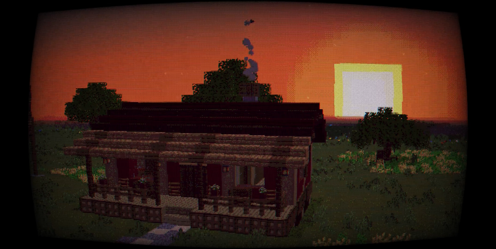

# Minecraft Retro PSX Shader

This is a simple Minecraft shader I wrote for Optifine 1.19.2, although it should work on most versions.

**Features Include:**

 * CRT Overlay with Tweakable Settings
 * PSX/PS1 Effects
   * Polygon Jitter
   * Texture Warping
   * Adjustable Colour Depth
   * Dithering
 * Adjustable Screen Resolution
 * Classic Minecraft Lighting Emulator (Primitive)

*Disclaimer: The image above is leveraging the amazing [Golden Days resource pack by thepoeticrainbow](https://www.curseforge.com/minecraft/texture-packs/golden-days)

## Setup

**Install Optifine:**

 1. Go to <https://optifine.net/downloads> and download the most recent version.
 2. Run the file with Java
 3. Follow the Instructions from the Installer

For a more detailed explanation, refer to [this article](https://www.selecthub.com/resources/how-to-install-optifine/)

**Install the Shader:**

 1. **Download** the shader by clicking `Code > Download Zip` at the top of this page.
 2. Find the `.zip` file in your Downloads and **extract**.
 3. Open the folder and copy `PSX by Kolosso`.
 4. If you are on Windows, open the search bar from your taskbar and type `%appdata%`
 5. Click `Roaming`.
 6. Open the `.minecraft` folder and navigate to `shaderpacks`. If it doesn't exist, create it.
 7. Paste the shader pack.

